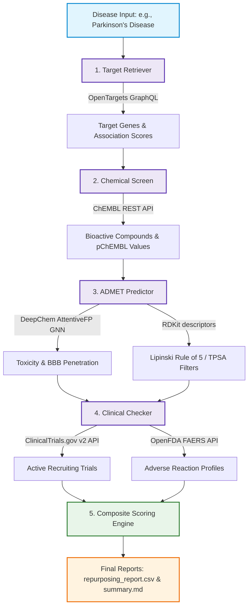

# ReNova: Automated ADMET & Drug Repurposing Engine

ReNova is a state-of-the-art, automated end-to-end computational drug discovery and repurposing engine. By integrating multi-omic target disease association data, bioactive compound databases, deep learning-based ADMET prediction models, and real-world clinical/adverse event registries, ReNova accelerates the identification of high-confidence drug candidates for complex diseases.

---

## 🚀 Key Features
- **Target Identification**: Programmatic queries to the **OpenTargets GraphQL API** to retrieve disease-associated target genes, sorted by association scores and filtered by therapeutic areas.
- **Chemical Screening**: Automated queries to the **ChEMBL API** to extract bioactive small molecules with high-affinity binding (using $p\text{ChEMBL}$ values) against identified targets.
- **ADMET Prediction**: A deep learning pipeline powered by **DeepChem's AttentiveFP Model** (graph neural network) running on GPU/CUDA to predict Blood-Brain Barrier Penetration (BBBP) and clinical toxicity (ClinTox), supplemented by **RDKit** to filter candidates via Lipinski's Rule of 5 and Topological Polar Surface Area (TPSA).
- **Clinical & Safety Profiling**: Live integration with **ClinicalTrials.gov (v2 API)** to check for active/recruiting trials and **OpenFDA FAERS** to profile top adverse reactions.
- **Composite Scoring**: A multi-parametric scoring system that ranks candidates based on potency, safety, blood-brain barrier permeability, and clinical maturity.

---

## 📊 Pipeline Architecture & Workflow

The diagram below illustrates the modular flow of the ReNova pipeline from disease input to the finalized candidate repurposing report.



---

## 🧮 Composite Scoring Formula

To rank small molecule candidates objectively, ReNova utilizes a multi-parametric **Composite Score ($S_c$)** defined as:

\[
S_c = 0.3 \cdot \left(\frac{p\text{ChEMBL}}{10}\right) + 0.4 \cdot (1 - T) + 0.2 \cdot P_{\text{bbb}} + 0.1 \cdot \left(\frac{C}{4}\right)
\]

Where:
- $p\text{ChEMBL}$ is the negative logarithm of the half-maximal maximal inhibitory concentration ($\text{IC}_{50}$) or inhibition constant ($K_i$).
- $T \in [0, 1]$ is the predicted clinical toxicity score (from the AttentiveFP ClinTox model).
- $P_{\text{bbb}} \in [0, 1]$ is the predicted probability of blood-brain barrier penetration (from the AttentiveFP BBBP model).
- $C \in [0, 4]$ is the maximum clinical development phase of the compound.

---

## 🛠️ Repository Structure

```directory
admet_repurposing_engine/
├── data/                  # Reference structures, target inputs, and cached datasets
├── models/                # DeepChem AttentiveFP model checkpoints (ClinTox, BBBP)
├── reports/               # Test execution logs and system verification reports
├── results/               # Generated reports, CSVs, and markdown summaries
├── scripts/               # Utility scripts (e.g., environment verification)
├── src/                   # ReNova Pipeline Core Source Code
│   ├── target_retriever.py    # OpenTargets disease-to-target retrieval
│   ├── chem_screen.py         # ChEMBL bioactive compound extractor
│   ├── admet_predict.py       # DeepChem & RDKit ADMET prediction engine
│   ├── clinical_checker.py    # ClinicalTrials.gov & OpenFDA safety verification
│   └── rdkit_helper.py        # RDKit descriptor calculation utilities
├── tests/                 # Comprehensive E2E and unit test suite
├── run_pipeline.py        # Main engine execution entrypoint
└── README.md              # Project documentation
```

---

## ⚙️ Setup & Installation

### Prerequisites
- **Operating System**: Windows / Linux / macOS (DeepChem & RDKit dependencies are pre-configured for conda envs).
- **Conda Environment**: Recommended Python 3.10+ with PyTorch, DeepChem, and RDKit installed.

### Environment Setup
Use the absolute path to your environment's Python executable. For example:
```bash
# Verify environments are correctly configured
& "C:\Users\kcwp264.DS\miniconda3\envs\sci_chem\python.exe" scripts/verify_envs.py
```

---

## 🏃 Running the Pipeline

To run the end-to-end drug repurposing engine for a target disease:

```bash
& "C:\Users\kcwp264.DS\miniconda3\envs\sci_chem\python.exe" run_pipeline.py "Parkinson's disease" --output-dir results
```

### Outputs Generated
- **`results/repurposing_report.csv`**: Stretches 12 parameters including ChEMBL IDs, SMILES, target genes, toxicity scores, Lipinski passes, active clinical trials, top adverse events, and composite scores.
- **`results/summary.md`**: An executive summary detailing top drug candidates, biological rationales, and pipeline statistics.

---

## 🧪 Testing & Validation

ReNova features a robust test suite (72/72 tests passing under mock server profiles) verifying API robustness, GNN model loads, and pipeline integrity.

To run the test harness:
```bash
& "C:\Users\kcwp264.DS\miniconda3\envs\sci_chem\python.exe" tests/run_tests.py
```
🔍 *Note: By default, tests run in mock mode using cached JSON server profiles to conserve API rate limits and ensure fast execution.*
