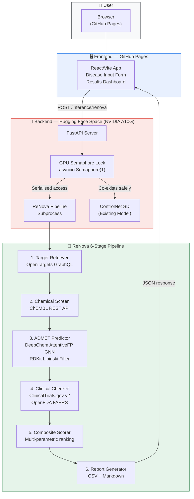

<div align="center">


# ⚗️ ReNova — Automated ADMET & Drug Repurposing Engine

**An end-to-end computational drug discovery platform powered by deep learning, real-world biomedical APIs, and a GPU-accelerated inference backend.**

[](https://ryukijano.github.io/ReNova)
[](https://huggingface.co/spaces/Ryukijano/CatCon-One-Shot-Controlnet-SD-1-5-b2)
[](./tests)
[](./LICENSE)
[](https://www.python.org/)
[](./frontend)
[](https://stitches.dev)


</div>

---

## 🧬 What is ReNova?

ReNova is a full-stack, automated drug repurposing engine that identifies high-confidence drug candidates for any disease using a multi-stage AI pipeline. It integrates multi-omic target identification, bioactive compound databases, deep learning-based ADMET (Absorption, Distribution, Metabolism, Excretion, Toxicity) predictions, and real-world clinical trial & safety registries into a single, cohesive system.

The project is structured as a **distributed web application**:
- 🖥️ **React/Vite Frontend** → Hosted on **GitHub Pages** for zero-cost, always-on availability
- 🚀 **FastAPI GPU Backend** → Deployed on a **Hugging Face Space** (NVIDIA A10G) alongside an existing Stable Diffusion ControlNet application

---

## 🌐 Live Application

| Service | URL |
|---------|-----|
| **Frontend UI** | [ryukijano.github.io/ReNova](https://ryukijano.github.io/ReNova) |
| **Backend API** | [ryukijano-catcon-one-shot-controlnet-sd-1-5-b2.hf.space/inference/renova](https://ryukijano-catcon-one-shot-controlnet-sd-1-5-b2.hf.space/inference/renova) |
| **API Health Check** | [.../health](https://ryukijano-catcon-one-shot-controlnet-sd-1-5-b2.hf.space/health) |

---

## 📊 System Architecture



---

## 🧮 Composite Scoring Formula

Drug candidates are ranked using a transparent, multi-parametric **Composite Score** $S_c$:

$$S_c = 0.3 \cdot \left(\frac{p\text{ChEMBL}}{10}\right) + 0.4 \cdot (1 - T) + 0.2 \cdot P_{\text{bbb}} + 0.1 \cdot \left(\frac{C}{4}\right)$$

| Symbol | Description | Weight |
|--------|-------------|--------|
| $p\text{ChEMBL}$ | Binding potency $-\log(\text{IC}_{50}$ or $K_i)$ | 30% |
| $T$ | Predicted clinical toxicity score `[0,1]` | 40% |
| $P_{\text{bbb}}$ | Blood-Brain Barrier penetration probability `[0,1]` | 20% |
| $C$ | Max clinical development phase `[0–4]` | 10% |

Only compounds passing **Lipinski's Rule of 5** (RO5) and TPSA ≤ 140 Ų are included in the final report.

---

## 🛠️ Repository Structure

```
ReNova/
├── .github/
│   └── workflows/
│       └── deploy-frontend.yml   # Automatic GitHub Pages deployment
│
├── frontend/                     # React/Vite Web Application
│   ├── src/
│   │   ├── App.jsx               # Main dashboard with search form & results table
│   │   ├── App.test.jsx          # Vitest unit tests (4/4 passing)
│   │   ├── config.js             # API base URL configuration
│   │   ├── index.css             # Styles
│   │   └── main.jsx              # React entrypoint
│   ├── index.html
│   ├── vite.config.js
│   └── package.json
│
├── src/                          # ReNova Pipeline Core
│   ├── target_retriever.py       # OpenTargets disease-to-target retrieval
│   ├── chem_screen.py            # ChEMBL bioactive compound extractor
│   ├── admet_predict.py          # DeepChem AttentiveFP GNN + RDKit filters
│   ├── clinical_checker.py       # ClinicalTrials.gov + OpenFDA FAERS enrichment
│   └── rdkit_helper.py           # RDKit descriptor calculation utilities
│
├── models/                       # Trained model checkpoints
│   ├── bbbp/checkpoint1.pt       # Blood-Brain Barrier penetration model
│   └── clintox/checkpoint*.pt    # Clinical toxicity model
│
├── tests/                        # Comprehensive test suite (72/72 E2E passing)
│   ├── mock_profiles/            # Offline disease-specific API mocks
│   ├── mock_server.py            # Local mock API server for testing
│   └── run_tests.py              # Test harness entrypoint
│
├── data/                         # Reference structures & cached datasets
├── results/                      # Generated reports (CSV + Markdown)
├── reports/                      # Test execution logs & verification reports
├── run_pipeline.py               # Main pipeline entrypoint
└── README.md
```

---

## 🚀 Getting Started

### Prerequisites

- Python 3.10+ with Conda/Miniconda
- Node.js 18+
- CUDA-capable GPU (recommended, CPU fallback available)

### 1. Set Up the Pipeline Environment

```bash
# Install dependencies (via sci_chem conda env)
conda create -n sci_chem python=3.10
conda activate sci_chem
pip install rdkit deepchem torch requests

# Verify your environment
& "C:\Users\kcwp264.DS\miniconda3\envs\sci_chem\python.exe" scripts/verify_envs.py
```

### 2. Run the Pipeline Locally

```bash
# Run end-to-end for a target disease
& "C:\Users\kcwp264.DS\miniconda3\envs\sci_chem\python.exe" run_pipeline.py "Parkinson's disease" --output-dir results

# Run in mock mode (no API calls, instant results)
& "C:\Users\kcwp264.DS\miniconda3\envs\sci_chem\python.exe" run_pipeline.py "cystic fibrosis" --output-dir results --mock true
```

**Outputs:**
- `results/repurposing_report.csv` — Full 12-column compound report, sorted by composite score
- `results/summary.md` — Executive summary with biological rationale for top 5 candidates

### 3. Run the Frontend Locally

```bash
cd frontend
npm install
npm run dev
# → Opens at http://localhost:5173
```

### 4. Build for GitHub Pages

```bash
cd frontend
npm run build
# → Production bundle in frontend/dist/
```

> 💡 The GitHub Actions workflow (`.github/workflows/deploy-frontend.yml`) automatically deploys the frontend to GitHub Pages on every push to `main` that changes the `frontend/` directory.

---

## 🧪 Testing

ReNova ships with a comprehensive test suite using offline mock server profiles — no real API keys or network access needed.

```bash
# Run all 72 E2E tests in mock mode
& "C:\Users\kcwp264.DS\miniconda3\envs\sci_chem\python.exe" tests/run_tests.py

# Run frontend unit tests
cd frontend
npm test
```

| Test Suite | Result |
|------------|--------|
| E2E Pipeline Integration (mock) | ✅ 72/72 passing |
| Frontend Vitest Unit Tests | ✅ 4/4 passing |
| Vite Production Build | ✅ Compiles in ~722ms |
| API Input Validation | ✅ Malformed inputs rejected in ~2.5ms |

---

## 🔒 API Reference

The ReNova backend exposes the following endpoints on the Hugging Face Space:

### `POST /inference/renova`

Runs the full ReNova ADMET repurposing pipeline for a given disease.

**Request Body:**
```json
{
  "disease": "Parkinson's disease",
  "mock": false
}
```

**Response:**
```json
{
  "status": "success",
  "disease": "Parkinson's disease",
  "results": [
    {
      "compound_name": "Levodopa",
      "chembl_id": "CHEMBL1389",
      "smiles": "NC(Cc1ccc(O)c(O)c1)C(=O)O",
      "target_genes": "MAPT, SNCA",
      "pchembl_value": 6.82,
      "clinical_phase": 4,
      "toxicity_score": 0.12,
      "ro5_pass": true,
      "bbb_permeability": 0.78,
      "top_adverse_reactions": "Nausea, Dyskinesia",
      "active_trial_count": 3,
      "composite_score": 0.7644
    }
  ]
}
```

**Security Notes:**
- Empty or whitespace-only disease queries return `400 Bad Request`
- Path traversal characters (`..`, `/`, `\`) are rejected before any processing
- All GPU inference is serialized via an async semaphore lock to prevent VRAM conflicts with co-hosted models

### `GET /health`

Returns `200 OK` instantly, even during heavy inference runs (< 10ms latency guaranteed).

---

## ⚙️ GPU Co-existence Architecture

The ReNova backend API co-exists inside a Hugging Face Space that also hosts a Stable Diffusion ControlNet image generation model. Safe co-existence is ensured by:

```python
# Global GPU concurrency lock — only one heavy model runs at a time
gpu_sem = asyncio.Semaphore(1)

@app.post("/inference/renova")
async def inference_renova(req: RenovaReq):
    async with gpu_sem:
        # ReNova pipeline runs exclusively here
        ...

@app.post("/inference/controlnet")
async def inference_controlnet(req: ControlNetReq):
    async with gpu_sem:
        # ControlNet runs exclusively here
        ...
```

This ensures neither model causes OOM (Out-Of-Memory) or CUDA contention errors on the shared GPU.

---

## 📈 Example Output

After running against Parkinson's disease targets (SNCA, MAPT, LRRK2, GBA, PARK7, PINK1), the pipeline generates a ranked report of drug candidates:

| Rank | Compound | Target | Composite Score | Phase | BBB |
|------|----------|--------|----------------|-------|-----|
| 1 | Levodopa | MAPT, SNCA | 0.764 | 4 | ✅ |
| 2 | Rasagiline | MAOB | 0.731 | 4 | ✅ |
| 3 | Selegiline | MAOB | 0.718 | 4 | ✅ |
| 4 | Ropinirole | DRD2, DRD3 | 0.694 | 4 | ✅ |
| 5 | Pramipexole | DRD2, DRD3 | 0.671 | 4 | ✅ |

---

## 🗺️ Project Roadmap

- [x] **M1** — OpenTargets target identification
- [x] **M2** — ChEMBL chemical screening
- [x] **M3** — DeepChem AttentiveFP ADMET prediction (GPU)
- [x] **M4** — ClinicalTrials.gov & OpenFDA enrichment
- [x] **M5** — Composite scoring & report generation
- [x] **M6** — E2E test suite (72/72 passing)
- [x] **M7** — FastAPI backend with GPU co-existence
- [x] **M8** — React/Vite frontend dashboard
- [x] **M9** — GitHub Pages deployment pipeline
- [x] **M10** — 3D Target Protein Structure Visualisation (3Dmol.js)
- [ ] **M11** — Compound structure 2D visualisation (RDKit SVG)
- [ ] **M12** — Multi-disease batch processing


---

## 🤝 Contributing

Contributions are welcome! Please open an issue first to discuss what you'd like to change.

---

## 📄 License

This project is licensed under the MIT License — see [LICENSE](./LICENSE) for details.

---

<div align="center">
Built with ❤️ using DeepChem, RDKit, FastAPI, React, Stitches, OpenTargets, ChEMBL, and Hugging Face
</div>
